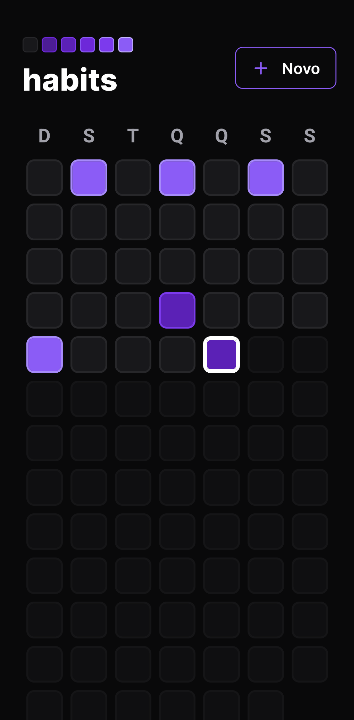

# NLW Setup Mobile

NLW Setup Mobile is a mobile project created through the Next Level Week online classes provided by Rocketseat.



## Getting Started

> This project is used along with [NLW-Setup-Server](https://github.com/mauriciocr22/nlw-setup-server)

First, you will need to install the dependencies with the following commands:

```sh
npm install
npx install-expo-modules@latest
```

After installing the dependencies, run the following command to start the server:

```sh
npx expo start
```

### Prerequisites:

- Node 16.13.2+

### Technologies

- Expo
- Typescript
- React Native
